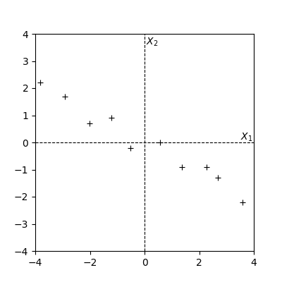
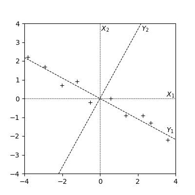
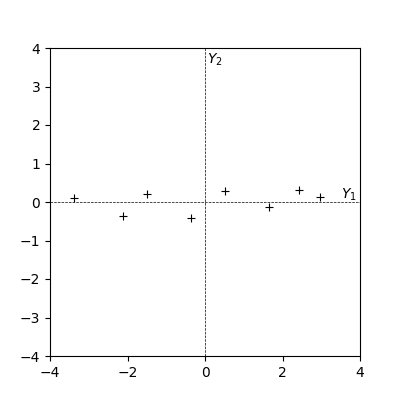
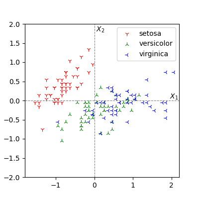
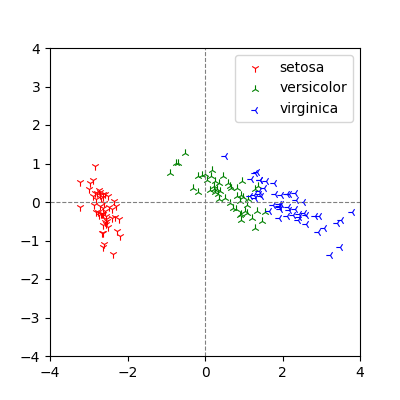
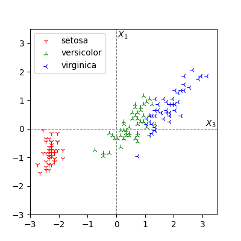
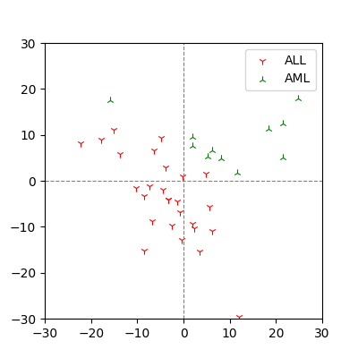

# Principal Component Analysis with Python

## Introduction

*Principal Component Analysis*, PCA is one of the most commonly used statistical methods for *pattern recognition* and *dimensionality reduction* on data defined in high dimensions.
It was introduced by *Karl Pearson* in 1901[1].
Later, as computers reached practical use, it also became one of the most fundamental methods of *machine learning*.

One of the most promising ideas to represent a subject more precisely is to use more variables, in other words, to represent the subject in higher dimension.
For this reason, these variables or dimensions are also referred to as *features*.

On the other hand, data expressed in such higher dimensions may not have essential features in all dimensions.
When data has redundancy in the defined dimensions and can actually be represented in lower dimensions than the defined dimensions, there is a possibility that the subject can be represented more essentially by dimensionality reduction.

## Assumptions of Datasets

A *dataset* is a set of partially or fully sampled data about a subject.

Let $X$ denote the entire dataset consisting of $N$ samples.
The data in $X$ do not always have the same dimension, but for simplicity, we assume that the all data are defined in the same dimension $n$.
If each data component is contained in the real number field $\mathbf{R}$, the dataset $X$ can be represented as a $(N \times n)$-matrix $X = [x_{i,j}] \quad (x_{i,j} \in \mathbf{R})$ with samples as rows and dimensions as columns.

As a preparation for later, denote the $i$-dimensional component of all samples by the vertical vector $X_i = \prescript{t}{}{(x_{1,i}, x_{2,i}, \dots, x_{N,i})}$.
Here, $X_i$ can be considered as an element of the $N$-dimensional real vector space $\mathbf{R}^N$, that is, $X_i \in \mathbf{R}^N$.

The vector and matrix representations defined here are used in the following calculations.

## Statistics

In preparation for PCA, we introduce the statistics that evaluate the features contained in the dataset, namely, *variance* and *covariance*.

### Variance

The variance is the sum of squares of the distance from the mean of each dimension averaged over $N-1$ for the dataset.
```math
\mathrm{var}(X_i) = \sum_{j=1}^N \frac{(x_{j,i}-\mu_i)^2}{N-1}
```
where $\mu_i$ denotes the average in $i$-dimension,
```math
\mu_i = \sum_{j=1}^N \frac{x_{j,i}}{N}.
```

Since variance is the mean of the sums of squares, its square root, *standard deviation* $s_i = \sqrt{\mathrm{var}(X_i)}$ is also often used as the standardized value.

When the variance is small, the variable represents poor features.
In particular, if the variance is zero, the variable can be ignored.
However, since random noise also has a certain variance, a large variance does not always mean that the features well represented by the variable.
In high-dimensional datasets, not all dimensions are represented by the same scale, so the values are often scaled based on the standard deviation or prior knowledge of the variable.

If the dataset is prepared by sampling a subset of the original data, it is possible that the variable that originally well represents the features of the subject may not be evaluated correctly due to the bias of the samples with small variance, or vice versa.
This is an essential issue when analyzing a subset of the dataset of interest.
We should consider eliminating bias by resampling or, if possible, treating all the data without sampling, however, this is often difficult in practice.

### Covariance

While variance evaluates the behavior of each dimension of the dataset, covariance evaluates the association between the dimensions of the dataset.
The covariance of $X_i$ and $X_j$ is given by
```math
\mathrm{cov}(X_i, X_j) = \sum_{k=1}^N \frac{(x_{k,i}-\mu_i)(x_{k,j}-\mu_j)}{N-1}.
```
We can say $\mathrm{cov}(X_i, X_j) = \mathrm{cov}(X_j, X_i)$ from the definition.
Also, $\mathrm{var}(X_i) = \mathrm{cov}(X_i, X_i)$, i.e., variance can be considered as covariance within the same dimension.

Unlike variance, $\mathrm{cov}(X_i, X_j)$ can also take negative value, and its value shows the following relationoship that 

- zero if $X_i$ and $X_j$ are independent,
- positive if $X_i$ and $X_j$ both increase or decrease,
- negative when one increases, the other decreases.

Therefore, if the absolute value of the covariance of two dimensions are large, we can say that the two dimensions share certain features including flipping.

### Covariance Matrix

The matrix $C$ determined by variances and covariances of all vectors in $X$ is called the *covariance matrix*.
```math
C = [\mathrm{cov}(X_i, X_j)].
```

The covariance matrix for a dataset defined in $n$ dimensions is a square matrix of order $n$.
Let $M_n(F)$ be the *full matrix ring* with the elements of the field $F$, then $C \in M_n(\mathbf{R})$.

Since we assumed $X_{i,j} \in \mathbf{R}$, $\mathrm{cov}(X_i, X_j) \in \mathbf{R}$ is almost obvious and $C$ is *real symmetric matrix* from $\mathrm{cov}(X_i, X_j) = \mathrm{cov}(X_j, X_i)$.
The diagonal component is equal to the variance $\mathrm{var}(X_i)$ in each dimension.

For variances and covariances, by definition, their values do not depend on the mean of each dimension.
Therefore, for each dimension $X_i$ of the dataset, we take the difference by the mean and set $\mu_i = 0$.
This operation is called *mean centering*.

In this case, the covariance is
```math
\mathrm{cov}(X_i, X_j) = \sum_{k=1}^N \frac{x_{k, i} x_{k, j}}{N-1} = \frac{\prescript{t}{}{X_i} X_j}{N-1}
```
and the covariance matrix $C$ can be expressed as
```math
C = \frac{\prescript{t}{}{X} X}{N-1}.
```

While we could perform a simple dimensionality reduction by removing poorly featured dimensions from statistics such as variance and covariance or removing dimensions with overlapping features, we can take this idea further and project all variables in the dataset to new variables such that the variances are maximized.

The new features obtained by the projection will also generally be of high dimension, and the new features can be selected in the order of largest variances.
This is the basic idea of PCA.

## PCA

First we take an example of Pearson's two dimensional dataset[1].

For this dataset, we perform mean centering. That is, $\mu_i = 0$ for all $i$.
The centered dataset $X$ is shown in Figure 1.



**Figure 1. Pearson's dataset centered by the mean.**

Calculating the covariance matrix of the centered dataset, we yield
```math
\mathrm{cov}(X) = \begin{pmatrix*}[r] 6.266 & -3.381 \\ -3.381 & 1.913 \end{pmatrix*}.
```
Since $\mathrm{var}(X_1) = 6.266$ and $\mathrm{var}(X_2) = 1.913$, each dimension has a certain variance, and from $\mathrm{cov}(X_1, X_2) = -3.381$, we see that these two dimensions share some features in the opposite directions.
These shared features will be represented as a single feature by the projection of PCA.

### Eigendecomposition of the Covariance Matrix

The essential computation of PCA is *eigendecomposition* of the covariance matrix $C$ of the dataset $X$.
When the operation of a matrix on a vector does not change the vector except for multiples of its coefficients, the coefficients and vectors are called *eigenvalues* and *eigenvectors*.
Let $C$ be a matrix, then 
```math
C e_i = \lambda_{i} e_i
```
where $\lambda_i$ are eigenvalues and $e_i$ are eigenvectors.

The covariance matrix $C$ is a real symmetric matrix.
In this case, the eigenvalues are known to have values in the real number field, i.e., $\lambda_i \in \mathbf{R}$.
It derives from the fact that a real symmetric matrix is a *Hermitian matrix*.
In general, for a square matrix $A$ defined by the field $\mathbf{C}$, let $A$'s conjugate be $\bar{A}$, $A$ is called a Hermitian matrix if $A = \prescript{t}{}{\bar{A}}$.

It is known that the eigenvectors of the Hermitian matrix are orthogonal to each other, and since the eigenvectors are determined by excluding multiples of the coefficients, we can take the *orthonormal* vectors as eigenvectors.

In fact, for Pearson's dataset, we yield 
```math
e_1 = \begin{pmatrix} 0.878 & 0.479 \end{pmatrix}, \quad e_2 = \begin{pmatrix} -0.479 & 0.878 \end{pmatrix}.
```
Let $W$ be a matrix of these eigenvectors aligned vertically.
```math
W = \begin{pmatrix} e_1 \\ e_2 \end{pmatrix} = \begin{pmatrix*}[r] 0.878 & 0.479 \\ -0.479 & 0.878 \end{pmatrix*}.
```
Since we take orthonormal vectors as eigenvectors, $W$ is an *orthogonal matrix*.
That is, $\prescript{t}{}{W} W = I$.

Let $\Lambda$ be a diagonal matrix whose diagonal components are the eigenvalues $\lambda_i$ corresponding to the eigenvectors,
```math
\Lambda = \mathrm{diag}[\lambda_i] = \begin{pmatrix} 8.111 & 0 \\ 0 & 0.069 \end{pmatrix}.
```
Using $\Lambda$ and the matrix $W$ of eigenvectors, we yield
```math
C = W \Lambda W^{-1}.
```
This is the eigendecomposition of $C$.

The components of the covariance matrix $C$ are the covariances between the dimensions of $X$, and if the covariances have certain values, then the corresponding dimensions are considered to share the feature.
The intuitive understanding of eigendecomposition of the covariance matrix is that by projecting them onto the orthonormal basis, each dimension represents an independent feature.

### Projection

In the case of a two-dimensional dataset, the projection to the same two dimensions by PCA gives a coordinate transformation on the same plane.
Figure 2 shows the centered coordinates $X_1, X_2$ and the projected coordinates $Y_1, Y_2$.



**Figure 2. Variance is maximized by projection.**

It can be seen that $Y_1$ has the largest variance, i.e., it captures the most significant feature of the dataset.
The new dimension obtained by the projection is called *principal components*.
We first dealt with the two-dimensional dataset because we can visually confirm that the variance is maximized by comparing the original and projected coordinates.
Later we will show an example with four-dimensional dataset, which is difficult to capture visually.

The projection of the dataset is obtained by using a matrix $W$ of eigenvectors, $T = X W$.
The result is shown in Figure 3.



**Figure 3. The projected dataset.**

The ratio of the variance of the projected dimension to the sum of the variances of all dimensions is equal to the ratio of the corresponding eigenvalue $\lambda_i$ to the sum of eigenvalues, $\lambda_i / \mathrm{tr}(\Lambda)$.

The inverse transformation of the projection is given by $X = T W^{-1}$.
We can say $W^{-1} = \prescript{t}{}{W}$ since $W$ is an orthogonal matrix.
Therefore, $X$ can be obtained by simply using the transposed matrix $X = T \prescript{t}{}{W}$.
Since $X$ was centered by the mean, the original data can be restored by adding the mean of the original dataset.

## Implementation in Python

The calculation of PCA is based on eigendecomposition of a matrix.
Here is an example using the Python numerical package `numpy`.

```python
# Mean centering
mu = np.mean(X, axis=0)
X = X - mu

# For matrix operations.
X = np.asmatrix(X)

# Covariance matrix
C = X.T * X / (N - 1)

# Eigendecomposition
L, W = np.linalg.eig(C)

# Sort eigenvectors in the descending order of eigenvalues.
W = W[:, np.flip(np.argsort(L))]

# Projection
T = X * W
```

A computational complexity of eigendecomposition of a square matrix of order $n$ should theoretically be close to $O(n^2)$, but in practice it is about $O(n^3)$ due to the calculation of the covariance matrix $C$ and the approximate computation.
Therefore, PCA is mostly implemented using *singular value decomposition*, SVD with a computational complexity of $O(n^3)$.

The SVD for $X$ is given by
```math
X = U \Sigma \prescript{t}{}{V}
```
where $U$ is a square matrix of order $N$, $\Sigma$ is a diagonal matrix with singular values as diagonal components, $V$ is a square matrix of order $n$, and $U$ and $V$ are orthogonal matrices.
That is, $U^{-1} = \prescript{t}{}{U}$ and $V^{-1} = \prescript{t}{}{V}$.
$V$ corresponds to the matrix $W$ of eigenvectors in the eigendecomposition except for the orientation.
Thus the projection is given by $T = X V$.

$\Sigma$ is a diagonal matrix with singular values $\sigma_i$ in its diagonal components, it is easy to see that $X V = U \Sigma$ from $\prescript{t}{}{V} = V^{-1}$.
Therefore $U \Sigma$ can be taken as the projection of the dataset.
Since $\Sigma$ is a diagonal matrix of singular values, this is less computationally expensive.

```python
# Singular value decomposition
U, S, Vt = np.linalg.svd(X, full_matrices=False)

# Singular values are already sorted.
assert np.allclose(S, np.flip(np.sort(S)))

# Projected coodinates T = U * S
T = U * np.diag(S)

# U * S = X * V
T = X * Vt.T
```

The eigenvalue $e_i$ of the covariance matrix $C = \prescript{t}{}{X} X / (N-1)$ and the singular value $\sigma_i$ of $X$ are in the relation $e_i = \lambda_i^2 / (N-1)$.
We can see that if we take the singular value decomposition of $X$ as $V = W$, then we have
```math
\prescript{t}{}{X} X = \prescript{t}{}{(U \Sigma \prescript{t}{}{W})} U \Sigma \prescript{t}{}{W} = W (\Sigma^2) \prescript{t}{}{W} = (N-1) W \Lambda \prescript{t}{}{W}.
```
Therefore, we can also calculate the ratio of variance of the projected dimension from the singular values.

## Unsupervised Learning

In the first example, we visually confirmed the projection on a two-dimensional dataset.
Next we will show an example where the results of the projection can be used to discriminate labels that are not used in the calculation, i.e., *unsupervised learning*, or more recently, the method is called *self-supervised learning*.

We take Fisher's iris dataset as an example[2].
This famous dataset measures four items, sepal length, sepal width, petal length, and petal width, for three iris species, setosa, versicolor, and virginica.
Again, we denote the i-th dimension of the dataset by $X_i$.

Although we cannot visually check the whole dataset since it is four-dimensional, if we represent it in two dimensions with $X_1$ and $X_2$, for example, it looks like Figure 4, indicating that it is difficult to linearly classify iris species in these dimensions.



**Figure 4. Iris dataset plotted by $X_1$ and $X_2$.**

The covariance matrix $C$ is a square matrix of order $4$.
```math
C = \begin{pmatrix*}[r]
     0.686 & -0.042 &  1.274 &  0.516 \\
    -0.042 &  0.190 & -0.330 & -0.122 \\
     1.274 & -0.330 &  3.116 &  1.296 \\
     0.516 & -0.122 &  1.296 &  0.581 \end{pmatrix*}.
```
Looking at $C$, there are certain covariances, indicating that PCA can map the shared features of multiple dimensions into one dimension by projection.

As a result of the eigendecomposition of $C$, its eigenvalues are
```math
e_1 = 4.228, \quad e_2 = 0.243, \quad e_3 = 0.078, \quad e_4 = 0.024.
```
The ratio of the eigenvalues to their sum of them as 0.925, 0.053, 0.017, 0.005.
This ratio is equal to the ratio of variance of the projected distination dimensions, which indicates that the variance of the dimension corresponding to the first two singular values contributing for over 95% of the total.
The results of the plot of these two dimensions are shown in Figure 5.



**Figure 5. Iris dataset projected by PCA and plotted in two dimensions with large variance.**

Although we did not use labels indicating the three species of iris when performing the projection, we can see that compared to Figure 4, Figure 5 better reflects the species of iris.

The projection matrix $W$ is
```math
W = \begin{pmatrix*}[r] 0.361 & -0.657 & 0.582 & 0.315 \\
       -0.085 & -0.730 & -0.598 & -0.320 \\
       0.857 & 0.173 & -0.076 & -0.480 \\
       0.358 & 0.075 & -0.546 & 0.754 \end{pmatrix*}.
```
Since the projection by the first column of $W$ gives the largest variance, we see that the third column of the original dataset has the largest contribution to this variable.

In fact, looking at Figure 6, which plots $X_3$ and $X_1$ of the original dataset, we observe that $X_3$ is a good feature that linearly discriminates iris species compared to the figure of the projected results, Figure 5.
This is an example of PCA obtaining the classification of labels in unsupervised learning.



**Figure 6. Iris datast plotted by $X_3$ and $X_1$.**

## Applications

Applications of PCA include *quantitative structure-activity relationship*, QSAR of small molecules and classification of diseases based on gene expression levels, etc.

### Classification of Leukemia

In 1999, Golub et al. classified two leukemia phenotypes, *Acute Lymphocytic Leukemia*, ALL and *Acute Myeloid Leukemia*, AML, based on gene expression levels using *clustering*[3].
The training dataset consisted of about 7,000 gene expression levels in 38 patients.
Here, we unsupervised learned this dataset with PCA. The results of the projection is shown in Figure 7.



**Figure 7. Projection by PCA of gene expression dataset for ALL and AML patients.**

It shows that the projection is able to classify almost linearly between ALL and AML in the training dataset.

While a number of genes in a gene expression dataset is high dimensional, it is not uncommon that the number of samples is much smaller than the number of genes due to the constraints of clinical studies.
In such cases, it is feasible to consider PCA, which can extract effective features by dimensionality reduction.

### QSAR dataset

QSAR handles properties based on the substructure of small molecules, so it was necessary to support high-dimensional datasets from an early time.
For QSAR, *neural networks* and *kernel methods* were known for analysis before *deep learning*.

## Note

Later, this *feature extraction* would be performed by *deep learning*.
In particular, we note that PCA is equivalent to a linear *autoencoder*.

## References

- [1] K. Pearson, *On lines and planes of closest fit to systems of points in space*, **Philosophical Magazine**, 2, 559-572, 1901.
- [2] R.S. Fisher, *The use of multiple measurements in taxonomic problems*, **Annals of Eugenics**, 7 (2), 179–188. 1936.
- [3] T.R. Golub et al., *Molecular Classification of Cancer: Class Discovery and Class Prediction by Gene Expression Monitoring*, **Science**, 286, pp531-537, 1999.
