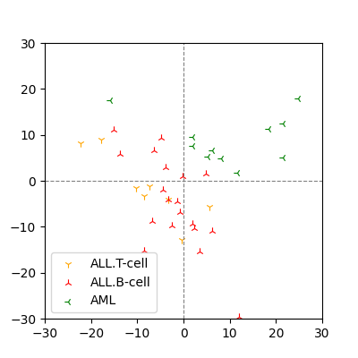

# Principal Component Analysis

## Introduction

One promising method to represent a subject more precisely is to represent the subject with more variables, in other words, with higher dimensions. These variables or dimensions that characterize a subject are referred to as *features*.

On the other hand, data represented in higher dimensions may not have essential features in all dimensions. When the data has redundancy in the defined dimensions and can actually be represented in lower dimensions than the defined dimensions, the operation to obtain an essential representation of the subject is called *dimensionality reduction*.

One of the basic methods for such dimensionality reduction is a statistical method introduced by *Karl Pearson* in 1901[^Pearson]. This method, now called *Principal Component Analysis*, PCA, also became known as one of the most fundamental methods in *machine learning* as computers later became practical. This article describes the computation of PCA.

## Dataset

First, we introduce a *dataset*. A dataset is a set of some or all of the data sampled for a given subject. For later calculations, we will formulate the dataset.

Let $X$ denote an entire dataset consisting of $N$ samples. Assuming that each data component is contained in the *real number field* $\mathbf{R}$, we can represent the dataset $X$ by the $(N \times n)$-matrix $X = [x_{i,j}] \quad (x_{i,j} \in \mathbf{R})$ with samples as rows and dimensions as columns.

Denote the $i$-dimensional components of all samples by the vertical vector $X_i = \prescript{t}{}{(x_{1,i}, x_{2,i}, \dots, x_{N,i})}$. Where $X_i$ is an element of the $N$-dimensional real vector space, $X_i \in \mathbf{R}^N$. Semantically, $X_i$ is a vector representing the $i$-th features.

The vector and matrix representations defined here are used in the following calculations. As an example, take the two-dimensional dataset used by Pearson[^Pearson], which is an example of $N=10, n=2$ in the notation introduced here.

```math
\begin{equation}
X = \begin{pmatrix*}X_1 & X_2\end{pmatrix*} = \begin{pmatrix*}[r]
0.0 & 5.9 \\
0.9 & 5.4 \\
1.8 & 4.4 \\
2.6 & 4.6 \\
3.3 & 3.5 \\
4.4 & 3.7 \\
5.2 & 2.8 \\
6.1 & 2.8 \\
6.5 & 2.4 \\
7.4 & 1.5 \end{pmatrix*}.
\end{equation}
```

## Basic Statistics

In preparation for the computation of PCA, we introduce the basic *statistics* that evaluate the features contained in the dataset, namely *variance* and *covariance*.

### Variance

The variance is the sum of the squares of the distances from the mean averaged over $N-1$ for each dimension of the dataset. Let $\mu_i$ denote the mean of the vector $X_i$,

```math
\mu_i = \sum_{j=1}^N \frac{x_{j,i}}{N},
```

and the variance of $X_i$ is defined as

```math
\mathrm{var}(X_i) = \sum_{j=1}^N \frac{(x_{j,i}-\mu_i)^2}{N-1}.
```

In general, when the variance is small, the characteristics represented by the variable are poor. In particular, if the variance is equal to zero, the variable can be ignored. However, since random noise also has a certain variance, a large variance does not necessarily mean that the variable represents features well.

### Covariance

Then we introduce *covariance* that evaluates the association between the dimensions of the dataset. The covariance of $X_i$ and $X_j$ is given by

```math
\mathrm{cov}(X_i, X_j) = \sum_{k=1}^N \frac{(x_{k,i}-\mu_i)(x_{k,j}-\mu_j)}{N-1}.
```

By definition, $\mathrm{cov}(X_i, X_j) = \mathrm{cov}(X_j, X_i)$. Also, $\mathrm{var}(X_i) = \mathrm{cov}(X_i, X_i)$, i.e. the variance can be regarded as the covariance within the same dimension.

Unlike variance, $\mathrm{cov}(X_i, X_j)$ takes negative value, indicating the following relationship that

- zero if $X_i$ and $X_j$ are independent,
- positive if $X_i$ and $X_j$ are both increasing or decreasing,
- negative when one increases, the other decreases.

Therefore, if the absolute value of the covariance of two dimensions are large, we can say that the two dimensions share certain characteristics.

### Covariance Matrix

We have considered the relationship between each feature, then we will turn to the entire dataset. That is, using the variances and covariances, we construct the matrix $C$ representing the variances and covariances among all vectors in $X$ as

```math
C = [\mathrm{cov}(X_i, X_j)].
```

$C$ is called the *covariance matrix* of $X$. Looking at the properties of the covariance matrix, $C$ for a dataset defined in $n$ dimensions is a square matrix of order $n$, let $M_n(F)$ be the *full matrix ring* of order $n$ with the elements of the field $F$, where $C \in M_n(\mathbf{R})$. Since we have assumed to be $x_{i, j} \in \mathbf{R}$ about the dataset, $\mathrm{cov}(X_i, X_j) \in \mathbf{R}$ is almost obvious and we see that $C$ is a *real symmetric matrix* since $\mathrm{cov}(X_i, X_j) = \mathrm{cov}(X_j, X_i)$. In particular, for $i = j$, i.e., the diagonal component of $C$ are equal to the variance $\mathrm{var}(X_i)$ in each dimension.

## Principal Component Analysis

In the previous section, we obtained a covariance matrix $C$ that shows the association between each feature of the dataset $X$. We consider to obtain a projection from $X$ to a new variable such that the variance is maximized by a calculation using the covariance matrix $C$.

### Simplified Computation of Covariance Matrix using Mean Centering

To simplify the calculation of covariance later, take the difference by the mean $\mu_i$ for each dimension $X_i$ of the dataset, and transform the dataset to have zero mean. This transformation is called *mean centering*. From the definition of covariance, the value does not depend on the mean of each dimension. Actually, let $X$ denote the original dataset and $X^{\prime}$ denote the dataset that has been centered by the mean, then $X^{\prime}_i = X_i - \mu_i$ for each dimension of the dataset, and the covariance is

```math
\mathrm{cov}(X_i, X_j) = \sum_{k=1}^N \frac{(x_{k, i}-\mu_i)(x_{k, j}-\mu_j)}{N-1} = \sum_{k=1}^N \frac{x^{\prime}_{k, i} x^{\prime}_{k, j}}{N-1} = \mathrm{cov}(X^{\prime}_i, X^{\prime}_j).
```

Therefore, since $X$ and $X^{\prime}$ can be identified through the calculation of covariance, $X$ is treated below as a dataset centered by the mean. Then the calculation of covariance is simplified as

```math
\mathrm{cov}(X_i, X_j) = \sum_{k=1}^N \frac{x_{k, i} x_{k, j}}{N-1} = \frac{\prescript{t}{}{X_i} X_j}{N-1},
```

and the covariance matrix $C$ is obtained by

```math
C = \frac{\prescript{t}{}{X} X}{N-1}.
```

Actually calculating the covariance matrix of the centered dataset, we yield

```math
\mathrm{cov}(X) = \begin{pmatrix*}[r] 6.266 & -3.381 \\ -3.381 & 1.913 \end{pmatrix*}.
```

Since $\mathrm{var}(X_1) = 6.266$ and $\mathrm{var}(X_2) = 1.913$, each dimension has a certain variance, and since $\mathrm{cov}(X_1, X_2) = -3.381$, we see that these two dimensions have features that are shared in opposite directions. PCA represents these shared features as a single feature.

### Eigendecomposition of the Covariance Matrix

The essential computation of PCA is the *eigendecomposition* of the covariance matrix $C$ of the dataset $X$. When the operation of a matrix on a vector does not change the vector except for multiples of the coefficients, the coefficients and vectors are called *eigenvalues* and *eigenvectors*. That is, let $\lambda_i$ be the eigenvalues and $e_i$ be the eigenvectors of the matrix $C$,

```math
C e_i = \lambda_{i} e_i.
```

We mentioned that the covariance matrix $C$ is a real symmetric matrix. In this case, its eigenvalues are known to have values in the real number field, i.e., $\lambda_i \in \mathbf{R}$. This follows from the fact that a real symmetric matrix is a *Hermitian matrix*. In general, for a square matrix $A$ defined by the field $C$, let $\bar{A}$ be the conjugate of $A$, then $A$ is called a Hermitian matrix if $A = \prescript{t}{}{\bar{A}}$.

The eigenvectors of the Hermitian matrices are known to be orthogonal to each other, and since the eigenvectors are determined by excluding multiples of the coefficients, we can take *orthonormal* vectors as eigenvectors. If we define a matrix $W$ with these eigenvectors $e_i$ as rows, $W$ is an *orthogonal matrix*. That is, $\prescript{t}{}{W} W = I$.

Let $\Lambda$ be a diagonal matrix whose diagonal components are the eigenvalues $\lambda_i$ corresponding to these eigenvectors $e_i$. Then $C$ can be represented using $\Lambda$ and $W$ as follows. This is the eigendecomposition of $C$.

```math
C = W \Lambda W^{-1}.
```

Actually, calculating for the Pearson dataset, we yield

```math
e_1 = \begin{pmatrix} 0.878 & 0.479 \end{pmatrix}, \quad e_2 = \begin{pmatrix} -0.479 & 0.878 \end{pmatrix}.
```

Since $W$ is a matrix with eigenvector $e_i$ in the rows,

```math
W = \begin{pmatrix} e_1 \\ e_2 \end{pmatrix} = \begin{pmatrix*}[r] 0.878 & 0.479 \\ -0.479 & 0.878 \end{pmatrix*}.
```

$\Lambda$ is a matrix with diagonal components of eigenvalues corresponding to eigenvectors,

```math
\Lambda = \mathrm{diag}[\lambda_i] = \begin{pmatrix} 8.111 & 0 \\ 0 & 0.069 \end{pmatrix}.
```

Since $\prescript{t}{}{W} W = I$, we can use $W^{-1} = \prescript{t}{}{W}$ to calculate $W \Lambda W^{-1}$, which is equal to the covariance matrix $C$.

```math
W \Lambda W^{-1} = W \Lambda \prescript{t}{}{W} = \begin{pmatrix*}[r] 6.266 & -3.381 \\ -3.381 & 1.913 \end{pmatrix*} = C
```

The intuitive understanding of eigendecomposition of the covariance matrix is that by mapping the dimensions that share features onto an orthonormal basis, each dimension represents an independent feature.

### Projection

In the case of a two-dimensional dataset, the PCA *projection* to the same two dimensions gives a coordinate transformation on the same plane. The coordinates of the centered Pearson dataset and the projected coordinates are shown in Figure 1.


**Figure 1. $X_1, X_2$ are the coordinates of the centered Pearson dataset and $Y_1, Y_2$ are the coordinates of the projected destination. The projection maximizes the variance in each dimension.**

It can be seen that the variance of $Y_1$ is maximal, i.e., it captures the most significant features of the dataset. The new dimension obtained by the projection is also called *principal component*.

The projection of the dataset is obtained by $T = X W$ using the matrix $W$ composed of eigenvectors. The ratio of the variance of the projected dimension to the sum of the variances of all dimensions is equal to the ratio of the corresponding eigenvalue $\lambda_i$ to the sum of eigenvalues. Therefore, by comparing $\lambda_i$, the projected features can be selected in order of increasing variance.

```math
\frac{\mathrm{var}(Y_i)}{\sum_{i=1}^n \mathrm{var}(Y_i)} =  \frac{\lambda_i}{\sum_{i=1}^n \lambda_i} = \frac{\lambda_i}{\mathrm{tr}(\Lambda)}
```

The inverse transformation of the projection is given by $X = T W^{-1}$. Since $W^{-1} = \prescript{t}{}{W}$, $X$ is also obtained as $X = T \prescript{t}{}{W}$. As $X$ is centered by the mean, the original data can be restored by adding the mean of the original dataset to $X$.

## Implementation in Python

Here we show an example of calculation using the Python numerical package `numpy`. As mentioned in the previous section, PCA calculation of is based on the eigendecomposition of a matrix.

```python
# Mean centering.
mu = np.mean(X, axis=0)
X = X - mu

# Covariance matrix.
C = X.T * X / (N - 1)

# Eigendecomposition.
L, W = np.linalg.eig(C)

# Sort eigenvectors in the descending order of eigenvalues.
W = W[:, np.flip(np.argsort(L))]

# Projection.
T = X * W
```

By the way, the computational complexity of eigendecomposition of a square matrix of order $n$ should theoretically be close to $O(n^2)$, but in practice it is about $O(n^3)$ due to the calculation of the covariance matrix $C$ in advance. Therefore, PCA is mostly implemented in practical use using *singular value decomposition*, SVD, which has the computational complexity of $O(n^3)$.

The SVD for $X$ is given by

```math
X = U \Sigma \prescript{t}{}{V}
```

where $U$ is a square matrix of order $N$, $Sigma$ is a diagonal matrix with singular values as diagonal components, $V$ is a square matrix of order $n$, and $U$ and $V$ are orthogonal matrices. That is, $U^{-1} = \prescript{t}{}{U}$ and $V^{-1} = \prescript{t}{}{V}$. Also, $V$ corresponds to the matrix $W$ of eigenvectors in the eigendecomposition, except for the orientation. Thus the projection is given by $T = X V$.

Since the the diagonal component of $\Sigma$ is the singular value $\sigma_i$ and $\prescript{t}{}{V} = V^{-1}$, it is easy to see that $X V = U \Sigma$. Therefore $U \Sigma$ can also be taken as the projection of the dataset. This is less computationally demanding, considering that $\Sigma$ is a diagonal matrix.

```python
# Singular value decomposition.
U, S, Vt = np.linalg.svd(X, full_matrices=False)

# Singular values are already sorted.
assert np.allclose(S, np.flip(np.sort(S)))

# Projected coodinates T = U * S.
T = U * np.diag(S)

# U * S = X * V.
T = X * Vt.T
```

The eigenvalue $e_i$ of the covariance matrix $C = \prescript{t}{}{X} X / (N-1)$ and the singular value $\sigma_i$ of $X$ are in the relation $e_i = \lambda_i^2 / (N-1)$. In fact, if we take the singular value decomposition of $X$ so that $V = W$, then

```math
\prescript{t}{}{X} X = \prescript{t}{}{(U \Sigma \prescript{t}{}{W})} U \Sigma \prescript{t}{}{W} = W (\Sigma^2) \prescript{t}{}{W} = (N-1) W \Lambda \prescript{t}{}{W}.
```

Thus, the ratio of variance of the projected dimension can also be calculated from the singular values.

## Applications

Applications of PCA include *quantitative structure-activity relationship*, QSAR of small molecules and classification of diseases based on gene expression levels, etc.

### Classification of Leukemia

In 1999, Golub et al. classified two leukemia phenotypes, *Acute Lymphocytic Leukemia*, ALL and *Acute Myeloid Leukemia*, AML, using *clustering* based on gene expression levels[^Golub]. The dataset used for training consisted of about 7,000 gene expression levels in 38 patients. The results of *unsupervised learning* of this dataset with PCA is shown in Figure 2.



**Figure 2. Two-dimensional projection of gene expression dataset for ALL and AML patients using PCA.**

It can be seen that we are able to project the ALL and AML of the training dataset in a way that is almost linearly discriminative. In other words, PCA is an example of *unsupervised learning*.

While the number of genes in a gene expression dataset is high dimensional, it is not uncommon for the sample size to be an order of magnitude smaller due to the constraints of clinical research. In such cases, PCA, which extracts significant features by dimensionality reduction, is one of the effective methods.

Later, this *feature extraction* was performed by neural networks, which is called *deep learning*. In particular, we note that PCA is equivalent to a linear *autoencoder*.

[^Pearson]: K. Pearson, *On lines and planes of closest fit to systems of points in space*, **Philosophical Magazine**, 2, 559-572, 1901.
[^Golub]: T.R. Golub et al., *Molecular Classification of Cancer: Class Discovery and Class Prediction by Gene Expression Monitoring*, **Science**, 286, pp531-537, 1999.
