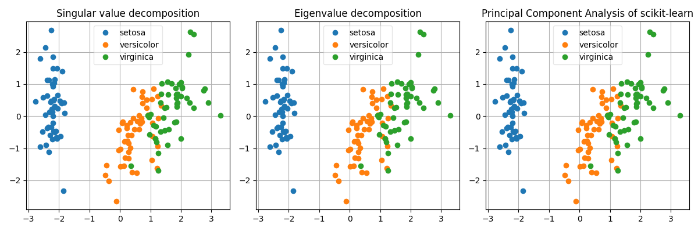
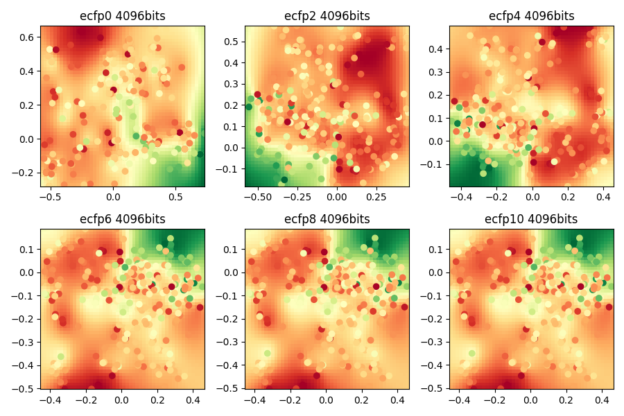

# Principal Component Analysis using Python

## Introduction

Principal Component Analysis (PCA) is the foundation of quantitative analysis and is one of the first methods to be tried in machine learning.
Mathematically, it is based on eigenvalue decomposition, and components similar to the basis can be arranged in order of increasing contribution.
It is one of the methods often used in visualization because it can perform dimensionality reduction with a relatively practical amount of computation for high-dimensional data.

## Implementations

There are two types of implementations: one using eigenvalue decomposition and the other using singular value decomposition (SVD).
From the viewpoint of computational complexity, the one using SVD is slightly more advantageous.
Here, I implemented both using the numerical package `numpy`.
I also verified the results by performing the same calculations using an implementation of the machine learning package `scikit-learn`.
For the validation, I used Fisher's famous iris dataset. It is included in the `scikit-learn` package.

### pca.py



## PCA of Chemical Compounds

One application of PCA in drug discovery is the dimensionality reduction of chemical fingerprints.
Chemical fingerprinting is the design of features based on the presence or absence and frequency of molecular substructures, and one of the most commonly used is the Morgran fingerprinting based on graph structure.
Converting molecular structures into chemical fingerprints enables quantitative analysis, and PCA can be used to discover features common to multiple molecules and their relationship to experimentally obtained properties.

## Dataset

In the application of PCA to compounds, a dataset on the solubility of small molecules was used.
Quantification was performed by Morgan fingerprinting from the structural formula of the molecule and visualized with dimensionality reduction by PCA.
The PCA as dimensionality reduction is useful in the analysis because the Morgan fingerprints are high dimensional due to subgraph-based calculations.

### fp.py



```
radius  0 matrix shape (257, 4096)  3.662sec
radius  2 matrix shape (257, 4096)  6.364sec
radius  4 matrix shape (257, 4096) 11.596sec
radius  6 matrix shape (257, 4096) 12.559sec
radius  8 matrix shape (257, 4096) 12.483sec
radius 10 matrix shape (257, 4096) 12.563sec
```

## Reference

- Peltason L et al., *Rationalizing three-dimensional activity landscapes and the influence of molecular representations on landscape topology and formation of activity cliffs.*, **J Chem Inf Model.**, 50, 1021-1033, 2010.
